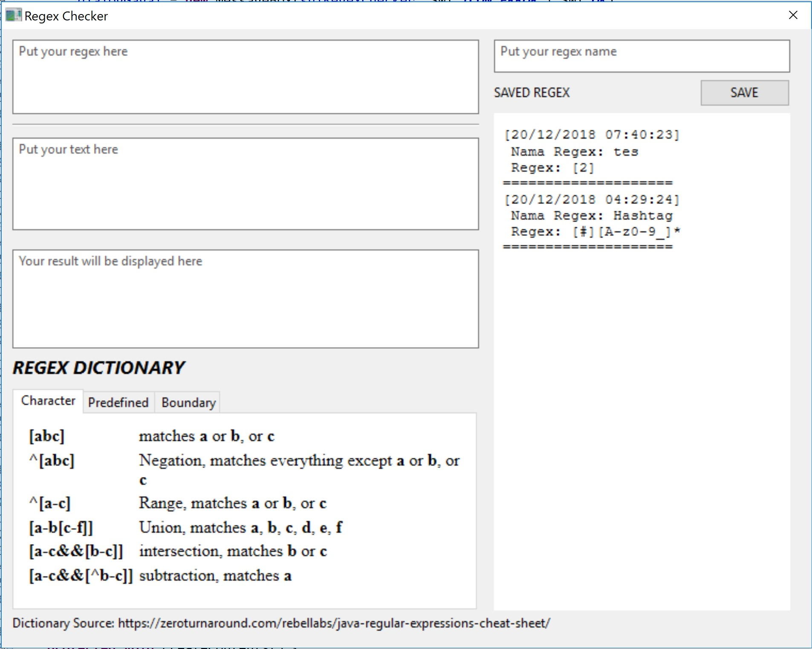

# REGEX CHECKER with JAVA
> Regex Checker Written in Java

[!java-image]
[!travis-image]

For my semester project. Making a regex checker like regex101.com written in Java

## External Library

* SWT Library
    * https://www.eclipse.org/swt/
* JxBrowser
    * https://www.teamdev.com/jxbrowser

## Installation

Import this to your workspace/project, add external library and install all recommendation library

<!-- Markdown link & img dfn's -->
[java-image]: https://img.shields.io/badge/Java%20Version-1.8.0-brightgreen.svg
[travis-image]:	https://img.shields.io/appveyor/ci/gruntjs/grunt.svg
